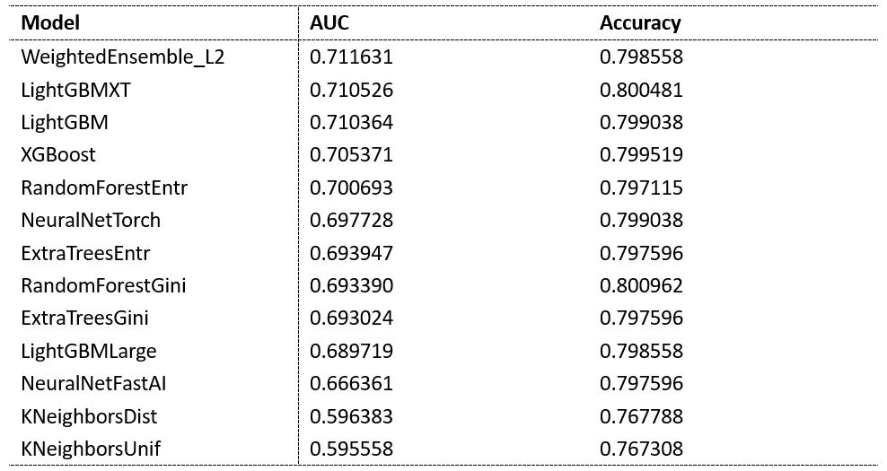
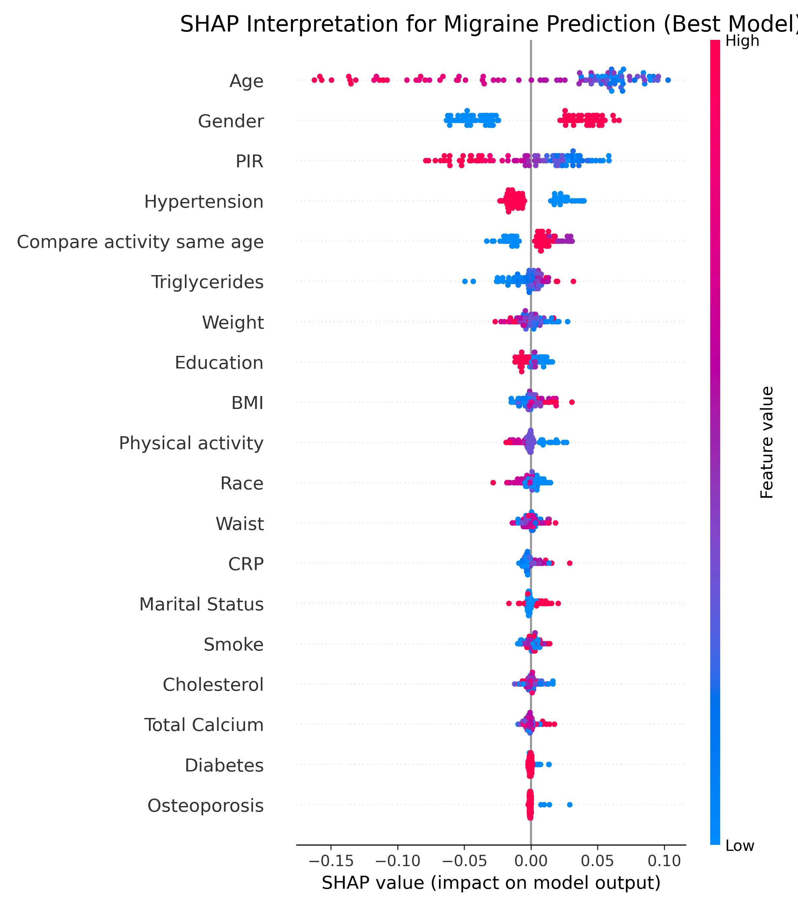

## 🧪 Experimental Results

### Model Performance
Our analysis shows that the **AutoGluon Ensemble** model achieved the highest predictive accuracy. By stacking multiple base learners, the model effectively captured non-linear patterns in migraine symptoms compared to traditional baselines.

  

  <b>Fig. 1.</b> Whole structure for A-Mel 

- **Top Performer:** AutoGluon (Accuracy: **0.798558**, AUC: **0.711631**)

---

### Feature Importance
Using SHAP interpretability analysis

  

  <b>Fig. 1.</b> Whole structure for A-Mel 

- **Key Features:** PIR, BMI.

